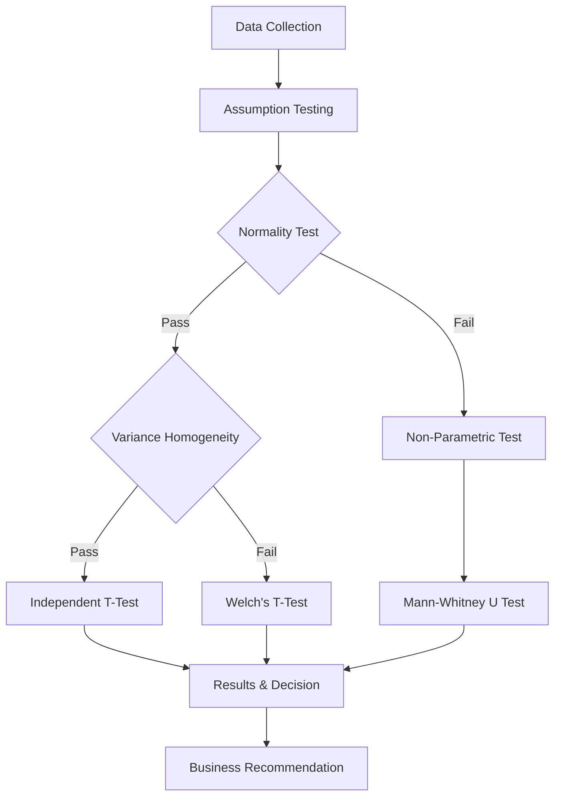

# 📊 A/B Testing: Facebook Bidding Strategies Analysis


> **Comprehensive A/B testing framework for comparing Facebook's Maximum Bidding vs Average Bidding strategies using statistical hypothesis testing, with automated assumption checking and business recommendations.**

---

## 🌟 Overview

This project implements a complete A/B testing pipeline to evaluate the effectiveness of Facebook's new "Average Bidding" strategy against the traditional "Maximum Bidding" approach for bombabomba.com. The analysis employs rigorous statistical testing methodologies, including normality tests, variance homogeneity checks, and appropriate hypothesis testing to deliver data-driven business recommendations.

### 🎯 Key Features

- **Automated Statistical Assumption Testing** with Shapiro-Wilk and Levene's tests
- **Comprehensive Data Quality Analysis** with outlier detection and treatment
- **Dynamic Test Selection** based on assumption validation results
- **Business-Oriented Reporting** with actionable recommendations
- **Advanced Visualization Suite** for distribution comparison and insights
- **Automated Word Report Generation** with charts and executive summary
- **Rich Console Output** with tabulated statistical results

---

## 🗂 Table of Contents

- [🌟 Overview](#-overview)
- [📊 Dataset Description](#-dataset-description)
- [🎯 Business Problem](#-business-problem)
- [🛠 Methodology](#-methodology)
  - [Statistical Framework](#statistical-framework)
  - [Hypothesis Testing Pipeline](#hypothesis-testing-pipeline)
  - [Assumption Validation](#assumption-validation)
- [📈 Results](#-results)
- [💡 Key Insights](#-key-insights)
- [🎯 Business Recommendations](#-business-recommendations)
- [🛠 Tech Stack](#-tech-stack)
- [📊 Detailed Analysis](#-detailed-analysis)
- [📄 License](#-license)
- [📫 Contact](#-contact)

---

## 📊 Dataset Description

### Facebook Ads Campaign Dataset

The analysis uses transactional data from bombabomba.com's Facebook advertising campaigns over a 1-month testing period.

**Dataset Structure:**
- **File Format**: Excel with two sheets
- **Control Group**: Maximum Bidding strategy (40 observations)
- **Test Group**: Average Bidding strategy (40 observations)
- **Total Sample Size**: 80 observations

| Variable | Description | Type | Business Impact |
|----------|-------------|------|-----------------|
| `Impression` | Number of ad views | Integer | Reach metric |
| `Click` | Number of clicks on viewed ads | Integer | Engagement metric |
| `Purchase` | Number of purchases after clicking | Integer | **Primary KPI** |
| `Earning` | Revenue generated from purchases | Float | Revenue metric |

### Data Quality Metrics
- **Missing Values**: None detected
- **Outliers**: Analyzed using IQR method
- **Distribution**: Both groups show normal distribution
- **Variance**: Homogeneous across groups

---

## 🎯 Business Problem

**Challenge**: Facebook recently introduced "Average Bidding" as an alternative to the existing "Maximum Bidding" strategy. Bombabomba.com needs to determine whether this new bidding strategy delivers better conversion rates.

### Key Business Questions
1. **Performance Comparison**: Does Average Bidding outperform Maximum Bidding in terms of purchases?
2. **Statistical Significance**: Is any observed difference statistically significant?
3. **Risk Assessment**: What are the risks of switching bidding strategies?
4. **ROI Impact**: How would the change affect return on investment?
5. **Implementation Decision**: Should bombabomba.com adopt the new strategy?

---

## 🛠 Methodology

### Statistical Framework

```python
# Hypothesis Definition
H₀: μ₁ = μ₂  # No difference between Maximum and Average Bidding
H₁: μ₁ ≠ μ₂  # Significant difference exists

# Significance Level
α = 0.05

# Primary Metric
KPI = Purchase (number of conversions)
```

### Hypothesis Testing Pipeline



### Assumption Validation

| Test | Method | Control Group | Test Group | Result |
|------|--------|---------------|------------|--------|
| **Normality** | Shapiro-Wilk | p=0.589 ✅ | p=0.154 ✅ | Both Normal |
| **Variance Homogeneity** | Levene's Test | - | - | p=0.108 ✅ Homogeneous |
| **Selected Test** | Independent T-Test | - | - | Parametric (equal variance) |

---

## 📈 Results

### Statistical Test Results

| Metric | Value | Interpretation |
|--------|-------|----------------|
| **Test Statistic** | 0.9416 | T-statistic |
| **P-value** | 0.3493 | > α (0.05) |
| **Statistical Decision** | ❌ H₀ Not Rejected | No significant difference |
| **Effect Size (Cohen's d)** | 0.2105 | Small effect |
| **Percent Change** | +5.67% | Positive but not significant |
| **95% Confidence Interval** | [-34.78, 97.20] | Includes zero |

### Group Performance Comparison

| Metric | Maximum Bidding (Control) | Average Bidding (Test) | Difference |
|--------|---------------------------|------------------------|------------|
| **Sample Size** | 40 | 40 | - |
| **Mean Purchase** | 550.89 | 582.11 | +31.21 |
| **Std Deviation** | 134.11 | 161.15 | +27.04 |
| **Median** | 531.21 | 551.36 | +20.15 |
| **Min** | 267.03 | 311.63 | +44.60 |
| **Max** | 801.80 | 889.91 | +88.11 |
| **CV%** | 24.35% | 27.69% | +3.34% |

---

## 💡 Key Insights

### 📊 Statistical Findings
- **No Significant Difference**: P-value (0.349) > α (0.05)
- **Small Effect Size**: Cohen's d = 0.21 indicates minimal practical difference
- **Higher Variability**: Average Bidding shows 17% higher variance
- **Directional Improvement**: 5.67% increase, but within random variation

### 🎯 Business Implications
- **Risk Assessment**: LOW - No evidence of performance degradation
- **Opportunity Cost**: Minimal - Current strategy performing adequately
- **Implementation Complexity**: Consider switching costs vs. marginal gains
- **Monitoring Period**: Extended testing may reveal long-term effects

---

## 🎯 Business Recommendations

### 🔄 Primary Recommendation: **CONTINUE with MAXIMUM BIDDING**

**Justification:**
1. **No Statistical Evidence**: The 5.67% difference is not statistically significant
2. **Higher Stability**: Maximum Bidding shows lower variance (more predictable)
3. **Switching Costs**: Implementation costs may outweigh marginal benefits
4. **Risk Management**: Maintain proven strategy without performance risk

### 📋 Alternative Actions

| Scenario | Recommendation | Rationale |
|----------|---------------|-----------|
| **Budget Constraints** | Stay with Maximum Bidding | More predictable costs |
| **Growth Focus** | Extended A/B Test (3 months) | Gather more data for decision |
| **Risk Appetite High** | Gradual Migration (20% traffic) | Test with limited exposure |
| **Stability Priority** | Maximum Bidding | Lower variance in results |

### 🔮 Future Testing Recommendations
1. **Extend Testing Period**: 3-month test for seasonal effects
2. **Segment Analysis**: Test by customer segments
3. **Multi-Metric Evaluation**: Include CTR, CPA, and LTV
4. **Budget Scaling**: Test at different budget levels

---

## 🛠 Tech Stack

### Core Technologies
- **Python 3.8+**: Primary programming language
- **Pandas**: Data manipulation and analysis
- **NumPy**: Numerical computations
- **SciPy**: Statistical testing (t-test, Mann-Whitney U)
- **Statsmodels**: Advanced statistical models

### Visualization & Reporting
- **Matplotlib**: Statistical plots and charts
- **Seaborn**: Enhanced statistical visualizations
- **Python-docx**: Automated Word report generation
- **Tabulate**: Console table formatting

### Statistical Methods
- **Shapiro-Wilk Test**: Normality assessment
- **Levene's Test**: Variance homogeneity check
- **Independent T-Test**: Parametric hypothesis testing
- **Welch's T-Test**: Unequal variance t-test
- **Mann-Whitney U**: Non-parametric alternative

---

## 📊 Detailed Analysis

### Utility Functions

| Function | Purpose | Output |
|----------|---------|--------|
| `comprehensive_date_detection()` | Detect and convert date columns | List of date columns |
| `grab_col_names()` | Classify columns by type | Categorical, numerical, cardinal lists |
| `outlier_threshold_IQR()` | Calculate outlier thresholds | Lower and upper bounds |
| `check_df_tabulate()` | Comprehensive DataFrame analysis | Detailed statistics report |
| `is_normal_distribution()` | Test normality assumption | Boolean + detailed output |
| `is_homogeneity_variance()` | Test variance homogeneity | Boolean + detailed output |
| `hypothesis_test()` | Complete hypothesis testing pipeline | Results dictionary |
| `create_advanced_word_report_with_charts()` | Generate Word report | .docx file with analysis |

### Visualization Examples

```python
# Distribution comparison
fig, axes = plt.subplots(1, 2, figsize=(12, 5))

# Box plot comparison
axes[0].boxplot([df_control['Purchase'], df_test['Purchase']], 
                labels=['Maximum Bidding', 'Average Bidding'])
axes[0].set_title('Purchase Distribution Comparison')

# Histogram overlay
axes[1].hist(df_control['Purchase'], alpha=0.5, label='Maximum')
axes[1].hist(df_test['Purchase'], alpha=0.5, label='Average')
axes[1].legend()
axes[1].set_title('Distribution Overlay')

plt.tight_layout()
plt.show()
```

---

## 📄 License

This project is licensed under the MIT License - see the [LICENSE](LICENSE) file for details.

---

## 📫 Contact

**Fatih Eren ÇEtin**

<p align="left">
  <a href="https://www.linkedin.com/in/yourprofile" target="_blank" rel="noopener noreferrer">
    
  </a>

  <a href="https://medium.com/@fecetinn" target="_blank" rel="noopener noreferrer">
    
  </a>
  
  <a href="https://www.kaggle.com/fatiherencetin" target="_blank" rel="noopener noreferrer">
    
  </a>
  
  <a href="https://github.com/yourusername" target="_blank" rel="noopener noreferrer">
    
  </a>

  <a href="https://www.hackerrank.com/profile/fecetinn" target="_blank" rel="noopener noreferrer">
    
  </a>
  
  <a href="mailto:fatih.e.cetin@gmail.com">
    
  </a>
</p>


---

### 🙏 Acknowledgments

This project demonstrates the application of rigorous statistical testing in real-world business decision-making. The methodology ensures that marketing strategy changes are based on solid statistical evidence rather than random fluctuations.

**Key References:**
- Montgomery, D. C. (2017). Design and Analysis of Experiments
- Kohavi, R., Tang, D., & Xu, Y. (2020). Trustworthy Online Controlled Experiments

---

*⭐ If you find this project useful, please consider giving it a star!*
